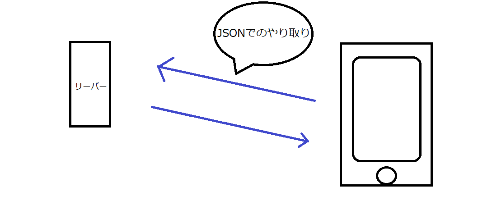
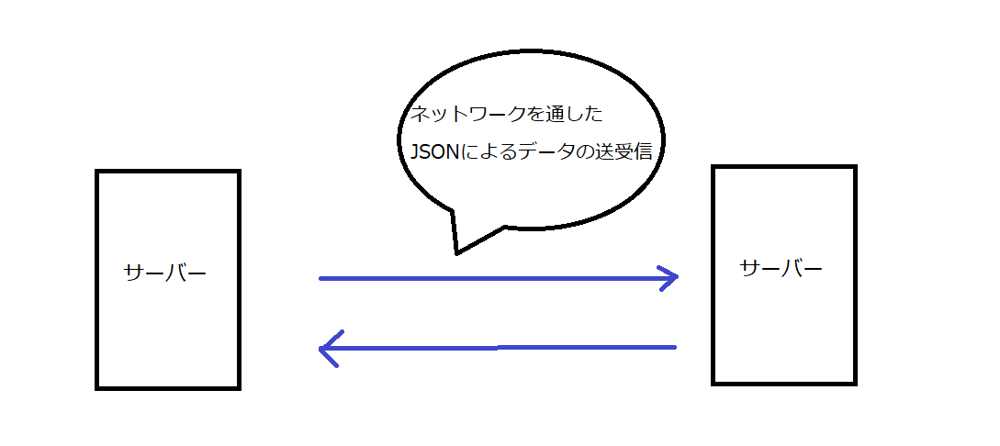
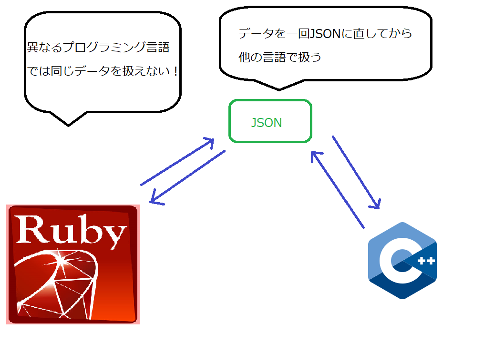

# JSON(ジェイソン)とは？
## JSONの基本情報
- ファイルの拡張子は".json"
- JSONはいくつかの情報を持ったオブジェクトを表す
- 各プログラミング言語にはJSONを扱うためのライブラリが用意されている事が多い

こんな感じのやつ↓
```
{
	“name”: “リザードン”,
	“weight”: 90.5,
	“height”: 1.7,
	“Type”: [ “ほのお”, “ひこう” ],
	“character”: “もうか”,
        "male": true
}
```

## どんな時に使うのか？
- アプリとサーバーのデータのやり取り
- サーバー同士のデータのやり取り
- 同じシステム内の、異なるプログラミング言語間のデータのやり取り

## プロコンとJSON
- 課題部門
  - [どんな時に使うのか？](##どんな時に使うのか？)で紹介した方法で使うかも！？

- 競技部門
  - サーバーからその試合のフィールド情報や開始時刻、対戦相手等の情報を取得しないといけない（procon30）
  - エージェントをどういう風に行動させたいかという情報をサーバーに送信する必要がある（procon30）

## 参考サイト
  [JSON入門](http://www.tohoho-web.com/ex/json.html)

## おまけ
|サーバー|概要|
|:-:|:-:|
|Webサーバー|アクセスするとHTMLを返すサーバー|
|APIサーバー|アクセスするとJSONを返すサーバー|
